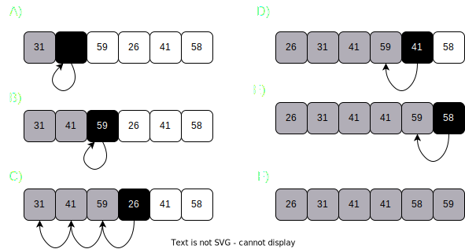
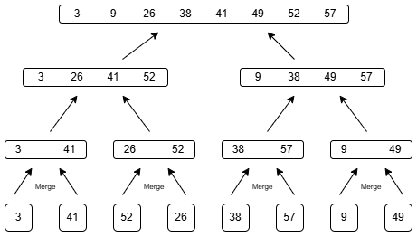

---
header-includes:
  - \usepackage{algorithm2e}
  - \usepackage{algpseudocode}
---

# Getting started

# Exercises 2.1

## 2.1 - 1
Using Figure 2.2 as a model, illustrate the operation of INSERTION-SORT on the array A = ⟨ 31, 41, 59, 26, 41, 58 ⟩.

## 2.1 - 2
Rewrite the INSERTION-SORT procedure to sort into nonincreasing instead of nondecreasing order.

$$
\begin{array}{l}
\textbf{Algorithm:} \text{Insertion Sort} \\
\textbf{Input:} \text{Array size n} \\
\textbf{Output:} \text{Sorted Array size n} \\
\textbf{Steps:} \\
1. \textbf{for}\text{ j = 2 to A.length} \\
    \quad 1.1 \; \text{A[i+1] = A[i]} \\
    \quad 1.2 \; \textbf{while} \; \text{i > 0 and A[i] \textcolor{red}> key} \;\\
    \quad \quad 1.2.1 \; \text{A[i+1] = A[i]} \\
    \quad \quad 1.2.2 \; \text{i = i -1} \\
    \quad 1.3. \; \text{A[i+1] = key} \\
\end{array}
$$

## 2.1 - 3
Consider the searching problem:

$$
\textbf{Input:} \text{A sequence of n numbers A = ⧼a1, a2, . . . , an⧽ and a value \textbf{v} .}\\
\textbf{Output:} \text{An index i such that v = A[i] or the special value NIL if v does not appear in A.}\\
$$

Write pseudocode for linear search, which scans through the sequence, looking for v. Using a loop invariant, prove that your algorithm is correct. Make sure that your loop invariant fulfills the three necessary properties.

$$
\begin{array}{l}
LINEAR-SEARCH(A, v) \\
1 \: \textbf{for } i = 1 \text{ to } A.length \\
2 \; \quad \textbf{if} \; A[i] = v \\
3 \; \quad \quad \text{print i} \\
4 \; \quad \quad break
\end{array}
$$
- **Initialization**. A[1] is the first element in the array, which is true
- **Maintanence**. In each iteration ***i*** will be within the boundaries $A[1..., A.length]$
- **Termination**. In the final loop ***i*** will be $ i = A.length + 1 = n+1 $, thus at that point **v was not found** in $ A $, the loop may end sooner in which case **v was found**
## 2.1 - 4
Consider the problem of adding two $n$-bit binary integers, stored in two $n$-element arrays $A$ and $B$. The sum of the two integers should be stored in binary form in an $(n + 1)$-element array $C$. State the problem formally and write pseudocode for adding the two integers.

- ### 1. Problem Statement
$$
\textbf{Algorithm: } \text{ADD-BINARY} \\
\textbf{Input: } \text{Two } n \text{-element arrays } A \text{ and } B\\
\textbf{Output: } \text{ Sum stored in a new Array C[n+1]} \\
$$

- ### 2. Pseudocode
$$
\text{ADD-BINARY} \\
\begin{array}{l}
1 \; \text{let C[n+1] be new array} \\
2 \; carry = 0 \\
3 \; \textbf{for } i = A.length \text{ to } 1 \\
4 \; \quad sum = (A[i] + B[i] + carry) \\
5 \; \quad C[i+1] = sum \;\%\; 2 \\
6 \; \quad carry = sum / 2 \\
7 \; C[1] = carry
\end{array}

$$

## 2.2-1
Express the function $ n^3/1000 - 100n^2 - 100n + 3 $ in terms of $Θ$-notation

> $Θ(n^2)$

## 2.2-2

Consider sorting $n$ numbers stored in array A[1:n] by first fidning the smallest 
element of $ A[1:n] $ and exchanging it with the element in $ A[1] $. Then find the 
time any better? 
smallest element of $A[2:n]$, and exchange it with A[2]. Then find the smallest element of A[3:n], and exchange it with A[3]. Continue in this manner for the $n$-1 elements of $ A $.Write pseudocode for this algorithm, which is known as **selection sort**. 

$$ 
\textbf{Algorithm: } \text{SELECTION-SORT} \\
\textbf{Input: } \text{Array } A \text{ of length } n \\
\textbf{Output: } \text{Sorted Array } A \\
$$

$$
\begin{array}{l}
\textbf{for } i = 1 \text{ to } A.length \\
\quad min-index = i \\
\quad \textbf{for } j = i + 1 \text{ to } A.length \\
\quad \quad \textbf{if } A[j] < A[min-index] \\
\quad \quad \quad min = j \\
\quad t = A[i] \\
\quad A[i] = A[min-index] \\
\quad A[min-index] = t \\

\end{array}
$$

- What loop invariant does this algorithm maintain?
  - **Initialization**. $i$ starts at 1 which is the first index in any Array of size $n > 0$. It always evaluates to True
  - **Mainenance**. Increments i as long as i < A.length.
  - **Termination**. When i reaches the value of $n$ means the nested loop has run n-1 times thus the algorithm has found the samllest number through $A[i:A.length] $ and put it at A[i] thus all indices have been assigned the righ values in increasing order and the *algorithm* is correct.
- Why does it need to run for only the first $n$-1 elements, rather than for all $ n $ elements? 
  - Because once the loop reaches the last index $ i $ the element in that position has been sorted already since the rest of indices in the array are sorted.
- Give the worst-case running time of selection sort in $Θ$-notation. Is the best-case running time any better?
$$
\begin{array}{l}
\textbf{Algorithm: } \text{SELECTION-SORT} \\
\textbf{Input: } \text{Array } A \text{ of length } n \\
\textbf{Output: } \text{Sorted Array } A \\
\quad \quad \quad \quad \quad \quad \quad \quad \quad \quad \quad \quad \quad \quad \quad \quad  \textbf Cost \quad \textbf{Time} \\
1 \; \textbf{for } i = 1 \text{ to } A.length - 1 \quad \quad \quad \quad \quad C_1 \quad \quad n \\
2 \; \quad minIndex = i \quad \quad \quad \quad \quad \quad \quad \quad \; \;  C_2 \quad \quad \; n - 1 \\
3 \; \quad \textbf{for } j = i + 1 \text{ to } A.length \quad \quad \quad \quad C_3 \quad \; \sum^n_{j=2} tj \\
4 \; \quad \quad \textbf{if } A[j] < A[minIndex] \quad \quad \quad \; \; \; C_4 \quad \; \sum^n_{j=2} (tj-1)  \\
5 \; \quad \quad \quad minIndex = j \quad \quad \quad \quad \quad \quad \; C_5 \quad \; \sum^n_{j=2} (tj - 1) \\
6 \; \quad \textbf{swap } A[i] \text{ with } A[minIndex] \quad \quad C_6 \quad \quad \; n-1 \\

\end{array}
$$

### Time Complexity
$$
C_1n + C_2(n-1) + C_3\sum_{j=2}^n tj + C_4 \sum_{j=2}^n (tj-1) + C_5 \sum_{j=2}^n(tj-1) + C_6(n-1)\\

$$
- Worst case

  - We have to compare each $A[i]$ to all elements in $A[j,...n]$ thus we can deduce the algorithm is $Θ(n^2)$
- Best case
  - It's not any better because the nested loop will traverse $A[j,...n]$ regardless.
  
  ## 2.2-3
  Consider linear search again (see Exercise 2.1-3). How many elements of the input sequence need to be checked on the average, assuming that the element being searched for is equally likely to be any element in the array? 
  
  > Taking into account that each position represents a probability of being th value $ v $ as 1/n. On average we'd have to traverse through half the array or n/2 because is a 50% chance of finding the elemnt, so half the time the element will be found in half the array.
  
  How about in the worst case? 
  
  - What are the average-case and worst-case running times of linear search in Θ-notation? Justify your answers.
  > #### Average case
    - We have a $ Θ(n/2) $, or more simply $ Θ(n) $
  > #### Worst Case
    - When $ v $ is the last element in the array thus iterating $ n $ times, Θ(n).
  ## 2.2-4 
  How can we modify almost any algorithm to have a good best-case running time?

> Check for each cases when the input is already in a solved state. Skip the computations by simply outputting the input.

## 2.3-1

Using Figure 2.4 as a model, illustrate the operation of merge sort on the array $A = ⟨ 3, 41, 52, 26, 38, 57, 9, 49 ⟩$.

## 2.3-2

Rewrite the MERGE procedure so that it does not use sentinels, instead stopping once either array L or R has had all its elements copied back to A and then copying the remainder of the other array back into A.

$$
\begin{array}{l}
\textbf{Algorithm: } \text{MERGE ALGORITHM} \\
\textbf{Input: } \text{Array } A \text{ of length } n, \text{indices } p, q, r \\
\textbf{Output: } \text{Sorted Array } A \\
\kern{16em} \\
1  \quad n_1 = q - p + 1 \kern{9.5em} \\
2  \quad n_2 = r - q \kern{11.4em} \\
3  \quad let \; L[1:n_1] \text{ and } R[1:n_2] \kern{5em} \\
4  \quad \textbf{for } i = 1 \text{ to } n_1 \kern{9.5em} \\
5  \quad \quad L[i] = A[p+i-1] \kern{6.2em} \; \;  \\
6  \quad \textbf{for } i =  1 \text{ to } n_2 \kern{9.5em} \\
7  \quad \quad R[i] = A[q+j] \kern{6.2em} \kern{2em}  \\
8  \quad i = j = k = 1 \\
9  \quad \textbf{while } i \le n1 \; and \; j \le n2 \\
10 \quad \quad \textbf{if } L[i] \le R[i] \\
11 \quad \quad \quad A[k] = L[i] \\
12 \quad \quad \quad i\mathrel{+}=1 \\
13 \quad \quad \textbf{else } A[k] = R[j] \\
14 \quad \quad \quad j \mathrel{+}=1 \\
15 \quad \quad k\mathrel{+}=1 \\
16 \quad \textbf{if } i > n_1 \\
17 \quad \quad  \textbf{for } k \; to \; r \\
18 \quad \quad \quad A[k] = R[j] \\
19 \quad \quad \quad j\mathrel{+}=1 \\
20 \quad \textbf{else} \\
21 \quad \quad  \textbf{for } k \; to \; r \\
22 \quad \quad \quad A[k] = R[i] \\
23 \quad \quad \quad i\mathrel{+}=1 \\

\end{array}
$$

## 2.3-3
Use mathematical induction to show that when $ n $  is an exact power of 2, the solution of the recurrence

$$
T(n) = \Bigg\{
  \begin{array}{l}
  2 \kern{5.9em} \textbf{ if } n = 2 \\
  2T(n/2) + n \quad \textbf{ if } n = 2^k, \textbf{ for } k > 1
  \end{array}\Bigg\} 

  \\ \text{is } T(n) = n \lg n
$$

> References taken from https://atekihcan.github.io/CLRS/02/E02.03-03/

### Base case
The base case when $ n = 2 $ is very straigforward. We merge $ \lg 2 $ times, and we know merging takes $ Θ(n) $. Thus $ 2 * \lg 2  = 2 (1) = 2$

### Mathematical Induction

We are assuming there is a number $ k $ which $ k > 1 $. Assuming the following:

$$
F(k) = 2^k \lg 2^k
$$

We develop $ T(2^k+1) $ when the function takes the next number power of 2.
$$
\begin{align*}
T(2^{k+1}) &= 2T(2^{k+1}/2) + 2^{k+1} \\
           &= 2T(2^k) + 2 \cdot 2^k \\
           &= 2 \cdot 2^k \lg 2^k + 2 \cdot 2^k \\
           &= 2 \cdot 2^k (\lg 2^k + 1) \\
           &= 2^{k+1} (\lg 2^k + \lg 2) \\
           &= 2^{k+1} \lg 2^{k+1}
\end{align*}
$$

## 2.3-4

Insertion sort can be expressed as a recursive procedure as follows. In order to sort $ A[1..n] $, we recursively sort $ A[1..n -1] $ and then insert $ A[n] $ into the sorted array $ A[1..n - 1] $. Write a recurrence for the running time of this recursive version of insertion sort.

$$
T(n) 
\Bigg\{
  \begin{array}{l}
  1 \kern{10em} \textbf{if } n = 1 \\
  T(n-1) + n-1 \kern{3.1em} \textbf{if } n > 1   
  
  \end{array}\Bigg\}
$$

## 2.3-5

Referring back to the searching problem (see Exercise 2.1-3), observe that if the sequence $ A $ is sorted, 
we can check the midpoint of the sequence against v and eliminate half of the sequence from further consideration. 
Binary search is an algorithm that repeats this procedure, halving the size of the remaining portion of the sequence each time. 
Write pseudocode, either iterative or recursive, for binary search. Argue that the worst-case running time of binary search is Θ(lg n).

$$
\textbf{Algorithm: } \text{BINARY-SEARCH}\\
\textbf{Input: } \text{Array } A \text{, value } v \text{, left boundary } l \text{, right boundary r}\\
\textbf{Output: } \text{ True if } v \text{ is found. False otherwise.} \\
$$

$$
\text{BINARY-SEARCH}(A, v, l, r) \\
\begin{array}{l}
\textbf{if } l > r \\
\quad return \; False \\
m = \lceil (l + r) / 2  \rceil \\
\textbf{if} A[m] < value \\
\quad return \text{ BINARY-SEARCH}(a, V, m\text{ + }1, r) \\
\textbf{else if } A[m] > value \\   
\quad return \text{ BINARY-SEARCH}(a, V, l, m\text{ - }1) \\
\textbf{else } return \; True
\end{array}
$$

### Algorithm Analysis

#### Intuition
In the **Worst Case Scenario** $ v $ is not present in the array $ A $. So we have to divide the array by 2 as many times as possible so we have that $ log n $ will be the number of subproblems and in each one we look at the middle element to check if it's the correct and we assume it takes $ Θ(1)$. Thus $ T(n) = T((n-1)/2) + Θ(1) $

#### Recurrence

$$
T(n) 
\Bigg\{
  \begin{array}{l}
  Θ(1) \kern{7.6em} \textbf{if } n = 1 \\
  T(n/2) + Θ(1) \kern{3.1em} otherwise   
  
  \end{array}\Bigg\}
$$

## 2.3-6
Observe that the while loop of lines 5 - 7 of the INSERTION-SORT procedure in Section 2.1 uses a linear search to scan (backward) through the sorted subarray A[1..j - 1]. 
Can we use a binary search (see Exercise 2.3-5) instead to improve the overall worst-case running time of insertion sort to Θ(n lg n)?

> Binary search wouldn't improve the running time, since we'd still have to shift the subarray to the so the time complexity would still be $Θ(n^2)$

## 2.3-7
Describe a Θ(n lg n)-time algorithm that, given a set S of n integers and another integer x, determines whether or not there exist two elements in S whose sum is exactly x.

$$
\textbf{Algorithm: } TwoSum \\
\textbf{Input: } \text{set of numbers S, x} \\
\textbf{Output: }\text{Returns wether exists a pair fo numbers that add together equal } x
$$

$$
\text{TWO-SUM(S, x)} \\
\begin{array}{l}
\textbf{for } i = 1 \text{ to } S.length \\
\quad a = A[i] \\
\quad target = x - a \\
\quad \textbf{if } \text{Binary-Search(S, target, 1, S.length)} \\
\quad \quad \text{ return } True \\
\text{return } False
\end{array}
$$